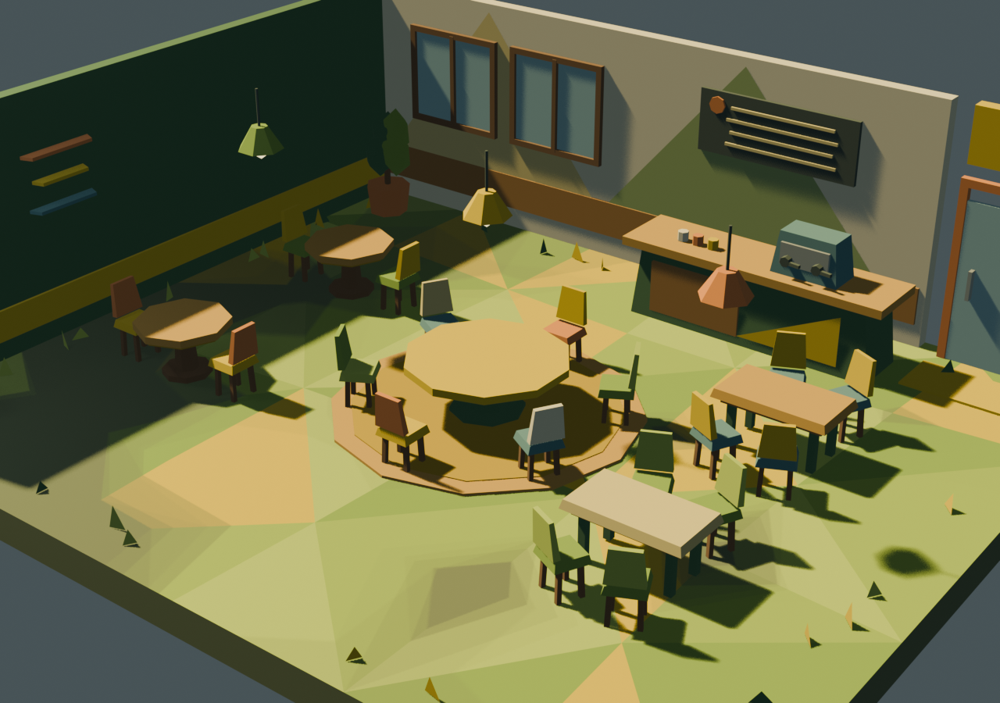
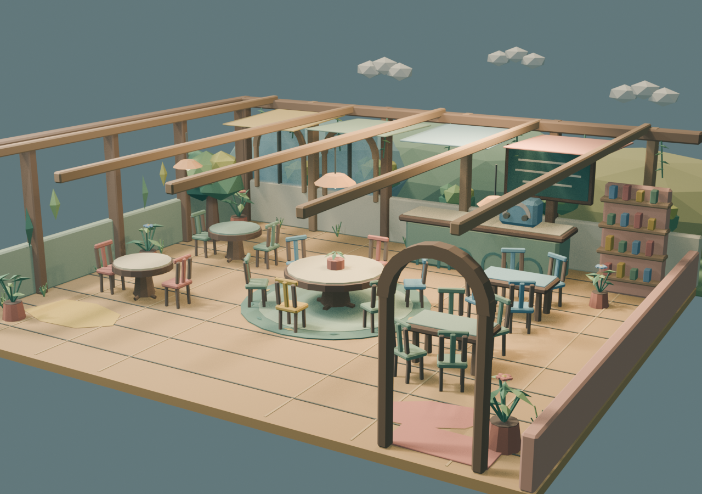

# EchoWorld Three.js 咖啡厅原型

## 本地运行

```powershell
npm install
npm run dev
```

打开 `http://127.0.0.1:5173/`。桌面使用 `W/A/S/D` 移动；触屏设备显示虚拟摇杆。

生产构建：

```powershell
npm run build
```

## 当前体验闭环

```text
标题页
-> 小镇夜集市（入口木门 -> 市集街道 -> 篝火广场 -> 花园小河；摊位即人物/共同课题入口）
-> 合照入场（左下「合照入场」：上传合照 -> AI 认脸 -> 逐脸确认姓名 -> 批量建档进展位）
-> 点选人物或摊位查看资料包（点按 = 看资料，每个摊位有专属配色）
-> 摊位旁 E 与 TA 聊聊 / F 进入“我与 TA”的关系场域（场域内 E 即触发共同记忆与线索）
-> 咖啡厅门口 E 进入木屋咖啡厅：桌位 E 坐下/起身（坐下即点单）、吧台 E 喝一杯，F 邀请熟人
-> 中央圆桌 E 发起会议并对话，会议中可随时提前结束；v1 房间内 PersonAgent 可自主靠近/应邀入座
-> 篝火边 E 围炉坐下 -> 现场联机入口（创建/加入房间、第一印象游戏），再按 E 离开
-> 世界播报即时显示邀请、圆桌和场域事件
-> 关系 Map / 集市 / 咖啡厅之间返回定位
```

场景包含 1 个玩家和 6 个 Agent。人物统一使用固定身体、五面头像的 MC 像素角色。中央六人桌只接受用户会议邀请，普通 Agent 调度不会占用它。

## 人物信号数据链路

```text
眼镜照片/音频 + 戒指 HR/PPG/ACC/历史指标
-> K3 统一时间轴、人物聚类、质量过滤与授权检查
-> 按 personId 形成版本化 PersonPackage
-> 照片生成 MC 像素贴图，声音进入服务端声音提炼，记忆与性格驱动 Agent
-> 后端统计服务生成 PersonSignal 快照与有序事件
-> Three.js 角色头顶心动值 + 咖啡厅/关系 Map 人物资料页
```

戒指记录的是佩戴者在一次相遇中的生理反应，并通过时间戳关联到当时识别到的人物；这是一种时间相关，不是情感因果判断。浏览器只接收聚合后的 `PersonSignal`，不会接收原始照片、音频或连续生理信号。完整字段、事件格式、实时/历史指标边界与隐私约束见 [`docs/PERSON_SIGNAL_PIPELINE.md`](docs/PERSON_SIGNAL_PIPELINE.md)。

## 代码边界

- `src/data/demoPeople.js`：人物、关系、资料与占位对话。
- `src/ui/CafeShell.js`：`intro -> cafe -> map` 体验、人物侧栏和圆桌会议 UI。
- `src/ui/RelationshipGraph.js`：7 个关系节点与 12 条关系边。
- `src/runtime/CafeLayout.js`：咖啡厅边界、5 张桌和 18 个 Blender 座位锚点。
- `src/runtime/NpcAgentSystem.js`：普通桌随机分配、入座、同桌对话与会议调度。
- `src/runtime/CharacterSystem.js`：人物 GLB 缓存、克隆、换色与实例生命周期。
- `src/runtime/CharacterVariants.js`：人物生产方案、匿名人物槽位和 URL 状态。
- `src/runtime/CharacterExpressionSystem.js`：按人物方案路由表情贴图、缓存和回退。
- `src/runtime/ProfileStore.js`：可编辑人物资料的版本化本地覆盖层。
- `src/runtime/PersonSignalStore.js`：按 `personId` 接收快照、拒绝过期/乱序事件并通知 UI。
- `src/runtime/HeartSignalSystem.js`：角色头顶的心动值 Sprite 与随分值变化的双脉冲动画。
- `src/runtime/RelationshipFieldSystem.js`：消费 `echo-field.v1` 生成可进入的关系场域与 4 类热点。
- `src/runtime/WorldModuleRegistry.js`：严格校验 `echo-world-modules.v1` 小屋/场域挂载契约。
- `src/runtime/WorldBroadcastSystem.js`：咖啡厅/集市大厅 3D 播报屏（位置按世界配置）与晨报摘要。
- `src/ui/SceneInteraction.js`：统一 E/F、触屏提示与情境菜单。
- `src/data/demoSignals.js`：6 个 NPC 的 `person-signal.v1` 占位快照，正式接口可直接替换。
- `src/main.js`：Three.js 场景、第三人称相机、移动、碰撞、射线选择和会议编排。
- `public/data/asset-catalog.json`：环境、人物和资料资产白名单。

原始照片、声音、embedding、内部记忆和安全存储地址不得复制到 `public/`。前端只消费授权过滤后的 DTO、`CharacterAsset` 和实时 `AgentEvent`。

人物生成分工、分支约定和 K3/Agent 跨模块契约见 [`docs/TEAM_WORKSTREAMS.md`](docs/TEAM_WORKSTREAMS.md)。后端服务（FastAPI）见 [`backend/README.md`](backend/README.md)；产品文档集（PRD、ROADMAP、架构、接口契约）见 [`docs/README.md`](docs/README.md)。
真实传感器输入、K3 接收、事实/推断、v1 Agent Runtime 到 Three.js 的完整现状图见
[`docs/REAL-DATA-WORLD-ARCHITECTURE.md`](docs/REAL-DATA-WORLD-ARCHITECTURE.md)。

## 场景风格

- `http://127.0.0.1:5173/?scene=v1`：保留原始粉彩咖啡厅。
- `http://127.0.0.1:5173/?scene=v3`：原创手绘幻想冒险版本，也是默认版本。

V2 几何场景资产仍归档保留，但不再出现在前端选择器中，旧 `?scene=v2` 地址会回落到 V3。场景共用同一套桌位、碰撞、NPC、圆桌会议和人物资料交互。Blender 生成命令、资产统计、GLB 限制和玩法空间契约见 [`docs/SCENE_VARIANTS.md`](docs/SCENE_VARIANTS.md)。

当前前端只启用像素人物方案：

- `http://127.0.0.1:5173/?scene=v3&character=voxel`：固定 Blender 身体与照片特征像素 atlas，也是默认方案。

绘本人物资产仍归档保留，但不再出现在前端选择器中，旧 `?character=storybook` 地址会回落到 `voxel`。

人物与表情生产契约、照片输入边界和服务接口见 [`docs/PHOTO_CHARACTER_PIPELINES.md`](docs/PHOTO_CHARACTER_PIPELINES.md)。运行时表情使用 `neutral / happy / surprised / thinking`，每次切换同一人物的完整 128x128 像素 atlas，并使用 nearest 采样。





## 当前限制

- 咖啡厅默认接 `/api/v1/rooms` + WebSocket：RoomService 是 NPC 位置、对话和会议唯一权威；连接失败才回退 `GET /api/v0/world/snapshot`。集市仍使用 v0 兼容快照。`?api=mock` 切离线静态演示。
- K3 Context Hub 可经 `/v1/physical-ai/*` 上传媒体与会话 package；服务端按人物拆出资料、音频、人脸/声纹证据、深度记忆、关系、体素角色和聚合 `PersonSignal`，已确认人物会进入大厅与 v1 咖啡厅。K3 相遇默认 L1，需在资料包里显式打开“Agent 记忆”才进入 prompt。
- 当前是可信单机：房间 API 尚无登录身份/room token，不应直接暴露到不可信公网或作为多用户生产服务。
- `?api=mock` 使用明确标注的 demo 生理信号；live 模式只读取 K3 Ring 聚合接口，没有真实值时显示不可用。后端只做会话时间窗统计，前端不自行判断喜欢、厌恶或医疗状态。
- 合照入场的照片输入已接真实链路：qwen-vl 定位前景人脸 bbox（OpenCV 兜底），逐脸确认姓名后批量建档；识别质量仍受照片清晰度影响，支持人工跳过/重新认脸。
- 人物暂时没有骨骼动画；移动和入座采用刚性模型的轻量表现。
- 关系场域支持 Marble splat 世界（配置 `WORLDLABS_API_KEY` 后 `POST /api/v0/fields/{person_id}/world` 触发生成，约 5 分钟/次、按次计费）：ready 时前端用 Spark 渲染 splat 并以 collider GLB 行走，未生成/失败时回退程序化场域。
- 咖啡厅使用运行时圆形桌面碰撞，尚未从 Blender 导出完整碰撞壳。
- 上游只负责提供 K3 package 与媒体归属；EchoWorld 负责事实分层、推断记忆、关系、体素资产、信号 DTO、Agent 授权和世界加载。embedding、原始 Ring 序列和内部存储地址不下发浏览器。
