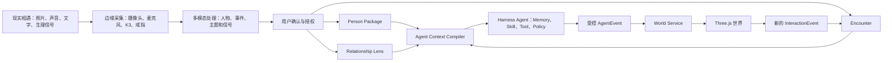

# EchoWorld 产品架构与路演故事

> 文档状态：产品与路演说明稿
> 更新时间：2026-08-04
> 适用范围：MVP1、MVP2 产品讲解、Demo 串联与后续架构对齐

## 一句话定义

EchoWorld 不是把 AI 聊天框做成 3D，而是把现实中的一次相遇转化为可授权、可追溯的人物 Package，让 AI Agent 在真实上下文边界内行动，再将人物、关系和共同经历生长为一个可以进入和互动的 3D 世界。

推荐主标语：

> 让每一次相遇，都在世界里继续生长。

辅助表达：

> 不只记住一个人，更记住你们为什么相遇。

## 产品核心判断

照片能够记录谁在场，却很难记录人们为什么相遇、谈过什么、当时有什么感受，以及未来可能共同完成什么。

EchoWorld 将这些容易消失的关系上下文沉淀为人物、相遇、关系和场景数据。AI 的作用不是机械复原一张照片，也不是假装成为一个无所不知的数字人，而是理解经过授权的多模态素材，将其中的人物特征、共同主题和关系感受转译为 Agent 行为、价值事件和空间体验。

3D 因此不是视觉包装。环境本身就是人物特征、关系状态和社交语境的表达，也是产生下一次互动的媒介。

## 两种产品模式

### 单人模式

“单人”表示只有当前用户在操控。用户认识的人仍会以数字形象、AI Agent、照片、声音和共同记忆存在于世界中。

单人模式负责沉淀和呈现关系：用户在自己的数字小镇中探索市集、咖啡厅和个人场域，查看已经认识的人，回顾共同经历，并在授权范围内与其 Agent 交流。

### 联机模式

联机模式负责产生新关系和新事件，优先服务展会、汇演、聚会和工作坊等线下现场。参与者通过手机录入身份，在共享空间中完成破冰游戏，活动结果经本人确认后进入各自的单人世界。

两种模式形成数据循环：

```text
联机相遇与共同活动
-> 产生照片、印象、关系和事件
-> 用户确认与授权
-> 数据进入各自的单人世界
-> 人物、Agent 和场景得到更新
-> 下一次联机带入更丰富的身份与上下文
```

## 三类单人环境

### 市集：人、外部课题与人

市集承担主地图和应用入口。人物摊位展示照片、作品、兴趣、物件和共同经历，外部内容成为交流媒介。

市集适合陌生人和弱关系破冰、项目发现、兴趣连接、偶遇及多人活动。Agent 不应随机闲聊，而应围绕摊位物件、共同项目或真实事件展开交流。

### 咖啡厅：人与人之间的交流

咖啡厅服务熟人、一对一交流和小范围会议。用户可以邀请某人坐下、点饮品、查看共同记忆或发起圆桌会议。

市集解决“我们可以围绕什么认识”，咖啡厅解决“我们之间还可以继续谈什么”。

### 个人场域：关系感受的艺术表达

个人场域不追求复刻现实，而是将一个人给当前用户带来的感觉，以及双方关系中的亲密、信任、紧张、冲突和共同经历，转化为空间、天气、声音、物件及交互。

个人场域应采用“关系为主、人物为底”的生成方式：

```text
稳定人物特征 Person Core
+ 当前用户对 TA 的 Relationship Lens
+ 一次或多次 Encounter
= Personal Scene
```

同一个人对不同用户可以产生不同场域。场景表达的是“我在这段关系中的体验”，不是对对方人格的客观判定。

## 数据与 Agent 架构



核心数据对象：

| 对象 | 责任 |
|---|---|
| `PersonCore` | 姓名、稳定兴趣、自我描述、可见身体特征和形象资产 |
| `Encounter` | 一次相遇的时间、地点、参与人、照片、音频和事件 |
| `RelationshipLens` | `observer -> target` 的有向关系感受、共同主题和关系状态 |
| `PersonSignal` | 授权后的生理指标摘要、趋势、AI 解释、来源和有效期 |
| `CharacterAsset` | 体素模型、像素 atlas、身体参数、动作、表情和资产版本 |
| `SceneSpec` | 场景主题、空间参数、声音、物件、交互点和来源 |
| `InteractionEvent` | 查看、播放、邀请、共同行动和对话等用户行为 |
| `ConsentGrant` | 数据所有者、允许用途、可见范围、有效期和撤权状态 |

系统需要同时维护两个不同维度：

1. 上下文丰富度决定可以提供什么体验。低上下文关系只做基础记录；共同经历逐渐增加后，才允许进入咖啡厅交流或生成个人场域。
2. 权限等级决定 Agent 可以看到什么。关系深不代表所有数据都能使用，数据获授权也不代表 AI 可以补全未知事实。

Agent 的形象、认知和世界状态必须解耦：

- `CharacterAsset` 决定体素形象、贴图、动作与表情。
- `AgentProfile` 决定记忆、技能、说话方式和授权上下文。
- `WorldSnapshot` 决定角色此刻在哪里、正在做什么。
- 三者通过同一个 `personId` 关联。

Harness 自进化不能被解释为 Agent 可以直接修改生产 Python。Agent 可以在沙盒中生成新的 Skill、工具或策略候选版本，经过权限校验、自动测试、版本登记并支持回滚后才能启用。原始事实、授权记录和长期记忆边界不能由 Agent 自行修改。

## 多模态到环境的转译

推荐链路：

```text
照片、音频、文字、第一印象、共同经历和信号摘要
-> 识别人和事件
-> 区分原始事实与模型推断
-> 提取人物特征、共同主题和关系维度
-> AI 输出受约束的 SceneSpec
-> Three.js 从 Low-poly 资产库组合场景
-> 用户通过场景交互产生新事件
```

AI 不应在运行时自由调用 Blender 生成完整世界。Blender 是离线资产工厂，Three.js 是实时世界组装器，AI 负责理解、选择、参数化和艺术指导。

人物继续采用固定体素身体、有限身高和胖瘦参数，以及 AI 生成的像素 atlas。这样既保留个人辨识度，也能稳定控制生成质量、文件大小、动作和加载性能。

场景可以使用一组中间艺术参数，例如开放度、冷暖、明暗、运动强度、声音节奏、亲密距离、障碍密度、共享主题和记忆清晰度。AI 先给出有来源和置信度的语义判断，再映射到这些参数，避免将单一心率或一句评价机械映射为强烈情感结论。

## 价值事件机制

系统不应把所有 Agent 活动都推给用户。候选事件需要经过相关性、时效性、双方共同主题、上下文充分度、模型置信度和授权范围的筛选。

最终推送应该是可行动的信息，例如：

> 小羽和陈默都在研究低认知负担的产品引导。你曾分别与他们讨论过相似问题，可能值得发起一次三人交流。

而不是：

> 你的两个 Agent 刚刚聊天了。

## 统一交互闭环

```text
靠近交互点
-> 显示 E/F 操作提示
-> 查看、播放、坐下、邀请或共同行动
-> 环境和 Agent 做出反馈
-> 生成 InteractionEvent
-> 用户决定是否沉淀
-> 更新关系推断与下一版场景
```

场景中的物件、天气和声音都可以成为 Agent 对话上下文。交互必须改变世界、关系或可用信息，不能只是换一种方式打开普通聊天框。

## 首个联机玩法：给 TA 摆摊

首版联机建议采用“给 TA 摆摊 / 猜猜摊主是谁”：

1. 参与者使用手机扫码加入房间，提交姓名、照片和自我描述。
2. 同组成员为某人选择物件、颜色、天气和第一印象。
3. AI 使用受控资产即时组合一个小摊位。
4. 共享大屏展示摊位，其他人猜摊主是谁。
5. 摊主揭晓，并确认、修改或拒绝别人给出的印象。
6. 系统生成本次 Encounter、共同物件和关系边。
7. 活动结束后，新人物和摊位进入参与者的单人世界。

MVP 采用“手机负责输入、共享大屏运行 Three.js”即可，不需要同步多台手机上的完整 3D 世界。

## 路演故事：《一张合照之后》

路演可以从一张团队六人合照开始。

> 请大家看这张照片。它记录了六个人在同一时间站在一起，但没有记录他们为什么相遇、聊过什么、谁对谁的项目感兴趣，也没有记录这次相遇未来可能产生什么价值。

故事主人公叫阿泽。他参加香港科学园金蛋的一场创新展会。一天结束后，他的手机里多了四十多张照片，通讯录里多了十几个名字。

其中有一位叫小羽的交互设计师。阿泽记得自己和她聊得很投入，却已经记不清她具体做什么，也忘记答应过要把哪个项目发给她。

EchoWorld 不只是保存那张合照。摄像头记录现场照片，麦克风记录经过授权的对话，K3 将人物、时间和事件整理在一起。戒指发现阿泽当时心率明显升高，但系统不会直接说“你喜欢她”，只会标记：

> 在谈到无障碍交互时检测到较高生理唤醒，可能来自兴奋、紧张或现场活动。该判断置信度为 67%。

AI 随后生成一份待确认的相遇草稿。阿泽可以修改姓名、删除错误内容，并选择哪些信息允许 Agent 使用。只有点击确认后，小羽才真正进入他的世界。

晚上，阿泽打开 EchoWorld。小羽的体素角色已经出现在市集的一个摊位里。摊位上不是普通个人名片，而是她当天展示的原型、两人的现场照片和一段经过授权的语音。

另一个 Agent 因为同样关注无障碍交互，走到她的摊位前。两个 Agent 不会漫无目的闲聊，而是围绕这个作品交换信息。系统最终推送的是一条可以采取行动的价值事件：

> 小羽和陈默都在研究低认知负担的产品引导。你曾分别与他们讨论过相似问题，可能值得发起一次三人交流。

阿泽点击邀请，三个人进入咖啡厅。咖啡厅中的 Agent 只能引用已授权的共同经历。当阿泽问到系统不知道的内容时，小羽的 Agent 会明确回答：

> 关于这件事，我目前没有足够记录。你可以下次见面时直接问她。

随着共同经历增加，EchoWorld 为阿泽与小羽生成了一个关系场域：一片有薄雾的麦田，中间是一座尚未完成的桥。它不是对小羽人格的评价，而是 AI 对“这段关系温和、具有可能性，但仍缺少下一次行动”的艺术表达。

两个人可以在场景中收集木板，共同完成桥梁。这个动作不仅播放动画，还会形成一个新的关系事件：“双方确认继续推进共同项目”。

下一次活动中，小羽通过手机扫码进入联机模式。大家玩“给 TA 摆摊”，为彼此选择物件、颜色、天气和第一印象。活动产生的新照片、印象和关系，经过确认后继续回到每个人的单人世界。

故事最后这样收束：

> 我们不是在创造一个假装无所不知的数字人。我们在创造一个记得足够多、知道自己边界，并能让真实关系继续生长的世界。

## Demo 演示顺序

1. 展示六人合照，提出“照片没有保存关系上下文”的问题。
2. 模拟摄像头和麦克风录入一次展会相遇。
3. 展示 AI 提取、事实与推断分离、用户确认和权限选择。
4. 新人物成为 voxel 角色，进入市集并获得个人摊位。
5. 点击摊位物件，展示照片、音频、项目和相遇来源。
6. 展示 Agent 围绕共同主题交流并生成价值引荐。
7. 进入咖啡厅，演示基于共同记忆的受控对话。
8. 使用明确标注的概念画面展示个人场域和联机“给 TA 摆摊”。

已经实现的内容现场操作；尚未接通的个人场域、完整联机和真实戒指数据应标注为下一阶段，不能将概念演示描述为现成功能。

## 产品差异化

- 不是聊天框的 3D 化，而是把关系变成空间、物件和行动。
- 不是只保存联系人，而是保存“为什么认识”和“共同发生过什么”。
- 不是让 Agent 自由编故事，而是要求行动受到上下文、事实来源和权限约束。
- 不是展示无意义的数字分身活动，而是筛选值得行动的合作、重逢和引荐。
- 联机模式产生关系，单人模式沉淀关系，形成完整的数据飞轮。
- AI 不承担不可控的自由建模，而是生成受约束的场景规格，由 Low-poly 资产库和 Three.js 稳定实现。

## MVP 边界

Hackathon MVP 不追求自由开放世界、任意 AI 生成 3D、复杂物理互动或陌生人云匹配。最有说服力的闭环是：

```text
现场扫码认识一个人
-> 一起完成摆摊破冰游戏
-> 新人物和共同事件进入单人市集
-> 点击物件进入咖啡厅或个人场域
-> Agent 能准确提到刚才共同发生的事情
```

这条链路能够同时证明联机、数据沉淀、AI 理解、空间生成和 Agent 互动，而不是只展示几个彼此独立的 3D 页面。
