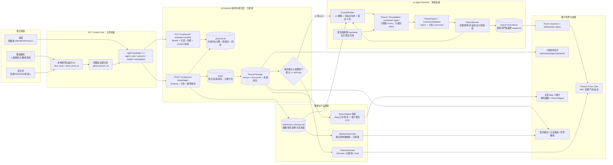
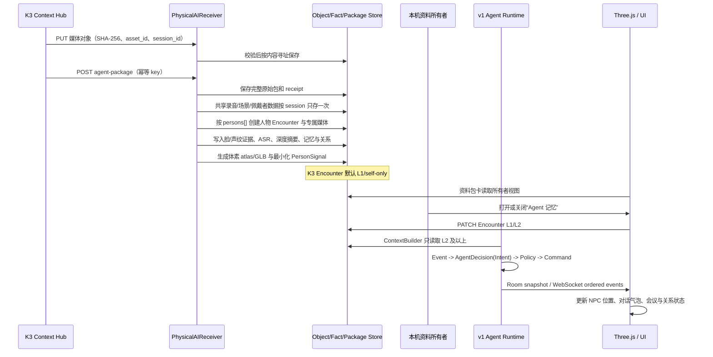
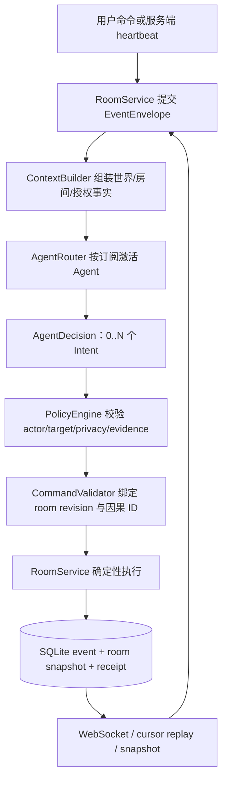

# EchoWorld 真实数据到数字世界架构

本文依据 `/root/AVjoint/SERVER_AGENT_INTEGRATION.md` 的完整 K3 契约，描述当前
可信单机演示的真实实现。K3 只负责提供会话 package；会话拆分、人物长期资产、
Agent 上下文与产品 DTO 均由 EchoWorld 下游完成。

## 1. 一张总图

## 2. 数据所有权与不可越过的边界

| 数据/状态 | 当前权威 | 规则 |
|---|---|---|
| 人脸/声纹局部 ID、跨模态证据 | K3 Context Hub | 服务端不接收 embedding，不把局部 ID 当全局身份 |
| `global person_id` 与媒体归属 | K3 Context Hub | 不确定内容进入 `unassigned`，不得强行归人 |
| 戒指生理数据 | 佩戴者本人 | 与附近说话轮次只有时间相关，绝不归到对话者身上 |
| 原始媒体与转写 | `facts/` + content-addressed object | 只增不改，推断不能覆盖事实 |
| 人物相遇资料 | PersonPackage | 未确认身份不进入 Agent；K3 新相遇默认 L1 |
| Agent 可见上下文 | ContextBuilder | 只放 L2/L3/L4；Agent 类本身不能访问 MemoryStore |
| 房间位置、会议、对话、关系计数 | RoomService + SQLite | 前端和 Agent 都只能提交命令/Intent，不能直接改状态 |
| 3D 表现 | Three.js | 只消费快照和有序事件，不是业务状态权威 |

可信单机的信任边界是“一台受控机器、一个 Uvicorn 进程、一个浏览器”。K3 接口有
Bearer token；房间 API 还没有登录身份和 room token，因此适合现场演示，不适合暴露
到不可信公网或多用户生产环境。

## 3. 一次真实相遇如何进入世界

上游协议到 `POST agent-package` 为止。此后的事实/推断分层、权限、Agent prompt、
房间事件和 UI 都是 EchoWorld 自己的下游架构。

## 4. Agent 行为闭环

当前 PersonAgent 已具备的行为：

- 用户在 3 米内发消息后，读取授权人物交集与最近 8 轮，使用已配置 LLM或模板回复。
- 服务端每个 heartbeat 每房间激活一个 NPC；它优先找互动次数较少的人，先靠近，
  进入距离后主动交谈。
- 收到圆桌邀请后由被邀请 PersonAgent 自己提交 `respond_meeting` Intent；RoomService
  接受后把它移动到圆桌范围。浏览器不再冒充 NPC。
- 对话最多保留最近 40 条消息；房间持久化对话轮数、共同会议次数、最后互动序号和
  每个 Agent 的 `maintain-relationships` 运行目标/最近动作。
- 所有动作仍经距离、成员、目标白名单、隐私和房间 revision 校验。LLM不能直接写
  SQLite、PersonPackage、场景坐标或前端 DOM。

## 5. 两张“资料卡”分别是什么

| 画面 | 组件与数据 | 定位 |
|---|---|---|
| 第一张“人物资料包 / PERSON PACKAGE” | `PackagePanel.js` -> `GET /api/v0/packages/{person_id}` -> PersonPackage | 真实照片、脸/声纹摘要、可播放分段/整段音频、深度推断与 Agent 记忆开关 |
| 第二张“资料 / 编辑 + 生理信号” | `CafeShell.js` + `GET /api/v0/people/{person_id}/signal` -> PersonSignalStore | live 模式只显示 K3 聚合；`?api=mock` 才加载 `demoSignals.js` |

两张卡不是同一个 DTO 的两种样式。Ring DTO 表达佩戴者在与该人物共同会话时间窗内
的聚合反应；多人会话明确标注不可归因到单一参与者。当前 K3 package 是会话结束后
上传，所以状态为 `recent`；持续实时流与 `person.signal.updated` 事件留到硬件常连阶段。

## 6. `v1` 到底指什么

| 名称 | 含义 | 是否对应一张卡 |
|---|---|---|
| `?scene=v1` | 原始粉彩咖啡厅视觉方案 | 否，只是场景视觉预设 |
| `/api/v1/rooms/*` | 新房间/Agent 事件运行时 | 否；它通过人物位置、气泡、会议和状态呈现在 3D 世界里 |
| `person-signal.v1` | 第二张卡消费的生理信号 DTO schema | 是，影响第二张卡的生理信号区域 |
| `environment.cafe.v1` | 资产目录中的咖啡厅环境版本 ID | 否，只是资产版本 |
| `echo-snapshot.v1` | 旧 `/api/v0/world/snapshot` 的响应 schema | 否，且不等于 API v1 |

所谓“5V1”不是当前代码中的正式对象或协议名。如果看到的是 `5 v 1`，需要回到具体
页面或标注判断；项目内可检索到的正式概念只有上表这些 `v1`。

## 7. 当前完成度与下一道闸

| 链路 | 状态 | 说明 |
|---|---|---|
| K3 媒体 + agent-package 接收 | 已接通 | 哈希、session、引用、schema 兼容、幂等回执均有测试 |
| K3 -> PersonPackage/资料包/大厅 | 已接通 | 已确认非佩戴者进入；未确认与 unassigned 不误归人 |
| K3 -> 体素 CharacterAsset | 已接通 | 授权头像生成 128 atlas、四表情和版本化 GLB，前端按 Package 动态加载 |
| K3 -> 摘要/长期记忆/人物关系 | 已接通 | 推断带事实指针；同场人物双向关系写入 `relations.md` |
| L1 -> Agent 隐私隔离 | 已接通 | `self-only` 已从 Agent 授权视图剔除 |
| K3 L1 <-> L2 审核 | 已接通 | 资料包开关显式授权或撤回该次 Agent 记忆 |
| v1 多轮对话/关系投影/自主行为 | 已接通 | 单进程稀疏调度，SQLite 可恢复 |
| v1 -> Three.js 咖啡厅 | 已接通 | 已确认 Package 自动加入房间并实例化 PersonAgent；失败才回退 v0 |
| K3 Ring -> PersonSignal | 已接通（会话后） | 输出聚合 `recent` DTO，原始样本不下发；常连实时事件后放 |
| 登录、room token、多实例 | 不在本阶段 | 可信单机无需；正式外网部署前必须实现 |

因此，可信单机演示的 K3 数据闭环已经不依赖前端 mock。仍应后放的是正式登录与
room token、多实例事件基础设施、外部对象存储，以及硬件常连时的实时信号推送；
这些不影响一次会话停止后进入人物世界的完整演示。

## 变更记录

- 2026-08-04 | 按 K3 1.1 接收契约与可信单机 v1 Runtime 实现建立现状架构图 | AI
- 2026-08-04 | 完成 K3 下游扇出、音视频/脸/声纹事实、记忆关系、体素资产、会话后 PersonSignal、L1/L2 授权与 v1 咖啡厅新人接入 | AI
